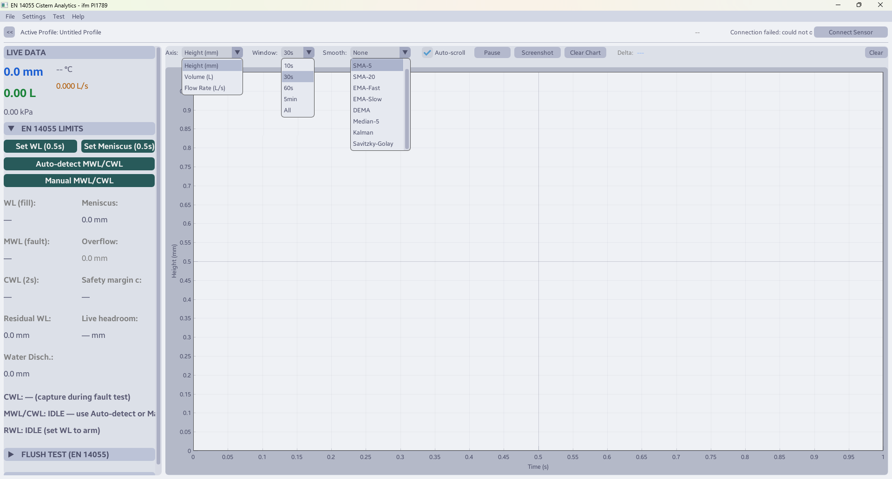
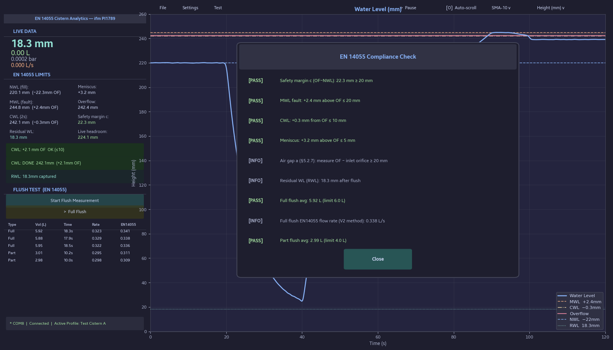

<div align="center">
  <h1>EN 14055 Cistern Analytics</h1>
  <p><b>A desktop application for testing and verifying WC flushing cistern compliance with EN 14055:2015 using an IFM PI1789 pressure sensor over IO-Link via an IFM AL1060 master.</b></p>

  [](#)
  [](#)
  [](#)
  [](#)
</div>

---

## Screenshots

### Live monitoring — flush cycle and fault test



### EN 14055 compliance check dialog



---

## Features

### Real-time monitoring
- Live water level (mm), volume (L), pressure (bar/mbar/kPa), temperature (°C) and flow rate (L/s)
- Sensor health status indicator (OK / Fault / Over-range / Under-range)
- 9 smoothing algorithms: None, SMA-5, SMA-20, EMA-Fast, EMA-Slow, DEMA, Median-5, Kalman, Savitzky-Golay
- Switchable chart axis: Height (mm), Volume (L), Flow Rate (L/s)
- Full scrollable graph history — pan and zoom into any past moment
- Delta measurement — click two points on the chart to measure the difference
- Dark and light theme (Catppuccin-inspired)

### EN 14055:2015 compliance testing

All seven levels are tracked with their correct height ordering:

```
MWL   (fault level, stable above OF  ≤ +20 mm)   §5.2.4a
CWL   (2 s after supply cut-off      ≤ +10 mm)   §5.2.4b
Meniscus (surface tension             ≤  +5 mm)   §5.2.4c
──── Overflow level (OF) ────
NWL   (normal fill, set by float / inlet valve)   §5.2.6
RWL   (residual after flush)
Seat  (seals minimum — V = 0 L calibration point)
```

**Automatic CWL detection** — arm while water is stable at MWL, then cut the supply. The detector finds the exact cut-off moment in the smoothed history and captures the level precisely 2 seconds later per §5.3.4.

**Automatic RWL detection** — arms when NWL is captured; detects the flush drop and captures the minimum level after a 2-second stability wait.

**EN 14055 Compliance Check dialog** reports:
- Safety margin c = OF − NWL ≥ 20 mm
- MWL − OF ≤ 20 mm
- CWL − OF ≤ 10 mm
- Meniscus − OF ≤ 5 mm
- Air gap note (ruler measurement per §5.2.7)
- Full flush ≤ 6 L, part flush ≤ 4 L

### Flush volume measurement
- Start/stop timing of full and part flush cycles
- EN 14055 V2 flow rate method: skips first 1 L and last 2 L of each flush
- Auto-stop when cistern level rises again (refill detected)
- Results table with volume, duration, average rate, and EN 14055 effective rate

### Chart
- Switchable Y-axis: Height (mm), Volume (L), or Flow Rate (L/s)
- Horizontal limit lines: NWL, MWL, CWL, Meniscus, Overflow
- Customisable line colours via dialog
- Drag lines to adjust NWL and CWL while paused
- Click two points to measure the difference (Delta)

### Calibration profiles
- Pressure → height → volume interpolation with unlimited calibration points
- "Read Sensor" button to auto-fill current pressure when adding a point
- Save/load profiles to JSON, import/export calibration data
- **Set as Default** — selected profile auto-loads on every startup

### Data export
- CSV logging: timestamp, pressure, height, volume, flow rate
- Atomic file writes (no partial files on crash)
- Chart screenshots (PNG export)

---

## Hardware

| Component | Description |
|-----------|-------------|
| IFM PI1789 | Relative pressure transmitter, 0–25 mbar, IO-Link |
| IFM AL1060 | IO-Link master, USB/RS-232 |

The sensor is mounted at the cistern base. Water height and volume are calculated from pressure via a user-defined calibration table (pressure → height → volume interpolation).

### PI1789 process data (PDIN) layout

| Bytes | Description | Format |
|-------|-------------|--------|
| 0–3 | Pressure | Unsigned 32-bit BE, 0.0001 bar/LSB |
| 4 | Sensor status | Bit flags (active-LOW): Ready, Over-range, Under-range |
| 5–7 | Reserved | — |
| 8–9 | Temperature | Unsigned 16-bit BE, 0.01 °C/LSB |
| 10–11 | Device status | — |

---

## Calibration

Open **Settings → Edit Calibration Profile** and add pressure/height/volume points:

1. **Seat point** — cistern empty (seals only): measure pressure, enter height, set volume = 0.0 L.
2. **NWL point** — normal fill level (where the float closes the inlet valve): measure pressure and height, enter fill volume.
3. Additional intermediate points improve accuracy at part-fill levels.
4. Set **Overflow (mm)** — height of the overflow pipe inlet.
5. Click **Save & Set Default** to auto-load this profile on startup.

---

## Installation

### Prerequisites

- Python 3.10+ (tested on 3.11 and 3.14)
- Windows 10/11

### Run from source

```bash
pip install dearpygui pyserial
python main.py
```

### Build single-file Windows EXE

#### Option 1: Local build

```bash
pip install pyinstaller dearpygui pyserial
pyinstaller main.spec --clean --noconfirm
```

The resulting `CisternAnalytics.exe` will be in the `dist/` folder. It bundles the Samsung Sans fonts and application icon. No console window.

#### Option 2: GitHub Actions (automatic)

Every push to `main`/`master` that changes source files triggers an automatic build via GitHub Actions. Download the latest EXE from [Actions → Build Windows EXE → Artifacts](../../actions/workflows/build-exe.yml).

You can also trigger a build manually from the Actions tab using **workflow_dispatch**.

---

## Project structure

```
main.py           — Application entry point and DearPyGui UI
sensor_core.py    — Sensor communication, data processing, EN 14055 logic
dpg_theme.py      — Font loading, theme setup
main.spec         — PyInstaller build configuration
icon.ico          — Application icon
fonts/            — Samsung Sans TTF fonts
config/           — Runtime settings and default profile (gitignored)
exports/          — CSV data exports (gitignored)
screenshots/      — README images
tests/            — Unit tests
```

---

## Sensor connection

1. Connect the IFM AL1060 master via USB.
2. In the app: **Settings → Hardware Connection**, select the COM port and baud rate.
3. Click **Connect Sensor**.
4. The status bar shows connection state and sensor health (OK / Fault).

---

This project is maintained in free time. If it saved you development hours, consider supporting it.
<p align="center">
  <a href="https://revolut.me/petk0g">
    
  </a>
</p>
