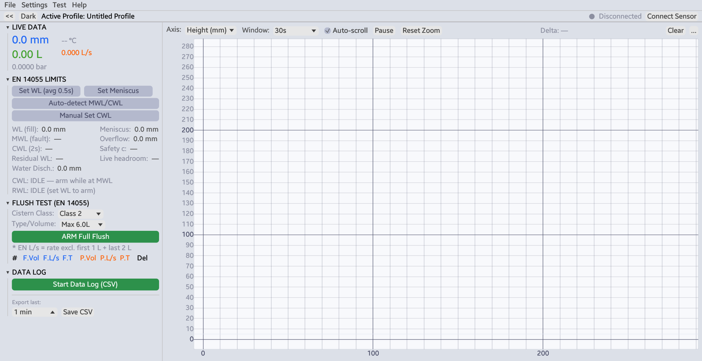
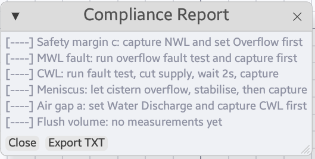

<div align="center">
  <h1>EN 14055 Cistern Analytics</h1>
  <p><b>A desktop application for testing and verifying WC flushing cistern compliance with EN 14055:2015 using an IFM PI1789 pressure sensor over IO-Link via an IFM AL1060 master.</b></p>

  [](#)
  [](#)
  [](#)
  [](#)
  [](../../actions/workflows/build-exe.yml)
  [](../../actions/workflows/build-rust.yml)
</div>

---

Two implementations are provided — a **Python/DearPyGui** reference app and a **Rust/egui** production app — sharing the same sensor protocol, calibration model, and EN 14055 test logic.

---

## Screenshots

### Live monitoring — flush cycle and fault test



### EN 14055 compliance check dialog



---

## Features

### Real-time monitoring
- Live water level (mm), volume (L), pressure (bar/mbar/kPa), temperature (°C) and flow rate (L/s)
- Sensor health status indicator (OK / Fault / Over-range / Under-range)
- 9 smoothing algorithms: None, SMA-5, SMA-20, EMA-Fast, EMA-Slow, DEMA, Median-5, Kalman, Savitzky-Golay
- Switchable chart Y-axis: Height (mm), Volume (L), Flow Rate (L/s)
- Full scrollable graph history — pan and zoom into any past moment
- Delta measurement — click two points on the chart to measure the difference
- Dark and light theme (Catppuccin-inspired palette)

### EN 14055:2015 compliance testing

All seven levels are tracked with their correct height ordering:

```
MWL   (fault level, stable above OF  ≤ +20 mm)   §5.2.4a
CWL   (2 s after supply cut-off      ≤ +10 mm)   §5.2.4b
Meniscus (surface tension             ≤  +5 mm)   §5.2.4c
──── Overflow level (OF) ────
NWL   (normal fill, set by float / inlet valve)   §5.2.6
RWL   (residual after flush)
Seat  (seals minimum — V = 0 L calibration point)
```

**Automatic CWL detection** — arm while water is stable at MWL, then cut the supply. The detector finds the exact cut-off moment in the smoothed history and captures the level precisely 2 seconds later per §5.3.4.

**Automatic RWL detection** — arms when NWL is captured; detects the flush drop and captures the minimum level after a 2-second stability wait.

**EN 14055 Compliance Check dialog** reports:
- Safety margin c = OF − NWL ≥ 20 mm
- MWL − OF ≤ 20 mm
- CWL − OF ≤ 10 mm
- Meniscus − OF ≤ 5 mm
- Air gap note (ruler measurement per §5.2.7)
- Full and part flush volume compliance per selected cistern class/type

### Flush volume measurement — ARM auto-detection

Flush start and stop are detected **fully automatically** — no manual timing required:

1. Press **ARM Full Flush** when the cistern is full and ready.
2. Flush the cistern. The ARM detector watches for a ≥ 1.5 mm water-level drop and retroactively anchors the measurement start to the local maximum in the pre-trigger buffer.
3. Recording stops automatically once the level rises ≥ 2 mm above the floor for 15 consecutive samples (≥ 3 s minimum duration).
4. After the full flush is saved, press **ARM Part Flush** and repeat.

Pairs of full + part flush results are stored together. The **EN L/s** rate uses the EN 14055 V2 skip-window method — the first 1 L and last 2 L of each flush are excluded from the flow-rate calculation.

The only manual inputs are the **cistern class** and **type variant** — values that are defined by the product specification, not measurable by the sensor:

| Class | Variant | Full flush | Part flush |
|-------|---------|------------|------------|
| Class 1 | Type 6 | 6.0–6.5 L | 3.0–4.0 L |
| Class 1 | Type 5 | 4.5–5.5 L | 3.0–4.0 L |
| Class 1 | Type 4 | 4.0–4.5 L | 2.0–3.0 L |
| Class 2 | Max 6.0 L | ≤ 6.0 L | ≤ 2/3 full |
| Class 2 | 4.5 L | 4.15–4.85 L | ≤ 2/3 full |
| Class 2 | 4.0 L | 3.70–4.30 L | ≤ 2/3 full |

Each result row is colour-coded **green (PASS)** or **red (FAIL)** per column.

### Chart
- Switchable Y-axis: Height (mm), Volume (L), or Flow Rate (L/s)
- Horizontal limit lines: NWL, MWL, CWL, Meniscus, Overflow
- Customisable line colours via dialog
- Vertical markers at each recorded flush event
- Click two points to measure the difference (Delta)

### Calibration profiles
- Pressure → height → volume interpolation with unlimited calibration points
- "Read Sensor" button to auto-fill current pressure when adding a point
- Save/load profiles to JSON, import/export calibration data
- **Set as Default** — selected profile auto-loads on every startup

### Data export
- CSV logging: timestamp, pressure, height, volume, flow rate
- Auto-rollover at 10 MB — continuous logging without file-size issues
- Export last N minutes as a snapshot CSV
- Chart screenshots (PNG export)

---

## Hardware

| Component | Description |
|-----------|-------------|
| IFM PI1789 | Relative pressure transmitter, 0–25 mbar, IO-Link |
| IFM AL1060 | IO-Link master, USB/RS-232 |

The sensor is mounted at the cistern base. Water height and volume are calculated from pressure via a user-defined calibration table (pressure → height → volume interpolation).

### PI1789 process data (PDIN) layout

| Bytes | Description | Format |
|-------|-------------|--------|
| 0–3 | Pressure | Unsigned 32-bit BE, 0.0001 bar/LSB |
| 4 | Sensor status | Bit flags (active-LOW): Ready, Over-range, Under-range |
| 5–7 | Reserved | — |
| 8–9 | Temperature | Unsigned 16-bit BE, 0.01 °C/LSB |
| 10–11 | Device status | — |

---

## Calibration

Open **Settings → Edit Calibration Profile** and add pressure/height/volume points:

1. **Seat point** — cistern empty (seals only): measure pressure, enter height, set volume = 0.0 L.
2. **NWL point** — normal fill level (where the float closes the inlet valve): measure pressure and height, enter fill volume.
3. Additional intermediate points improve accuracy at part-fill levels.
4. Set **Overflow (mm)** — height of the overflow pipe inlet.
5. Click **Save & Set Default** to auto-load this profile on startup.

---

## Installation

### Python app

**Prerequisites:** Python 3.10+ on Windows 10/11.

```bash
pip install dearpygui pyserial
python main.py
```

### Rust app

**Prerequisites:** [Rust stable toolchain](https://rustup.rs/) on Windows 10/11.

```bash
cd cistern_analytics
cargo run --release
```

---

## Building

### Option 1: Local build

**Python EXE:**
```bash
pip install pyinstaller dearpygui pyserial
pyinstaller main.spec --clean --noconfirm
# Output: dist/CisternAnalytics.exe
```

**Rust EXE:**
```bash
cd cistern_analytics
cargo build --release
# Output: cistern_analytics/target/release/cistern_analytics.exe
```

### Option 2: GitHub Actions (automatic)

Every push to `main`/`master` that changes source files triggers an automatic build. Download the latest EXE from the **Actions** tab:

- [Build Windows EXE (Python)](../../actions/workflows/build-exe.yml) — artifact: `CisternAnalytics-windows`
- [Build Rust App (Windows)](../../actions/workflows/build-rust.yml) — artifact: `CisternAnalytics-Rust-windows`

Both workflows can also be triggered manually using **workflow_dispatch**.

---

## Project structure

```
main.py                     — Python app entry point and DearPyGui UI
sensor_core.py              — Sensor communication, data processing, EN 14055 logic
dpg_theme.py                — Font loading, theme setup
main.spec                   — PyInstaller build configuration
icon.ico                    — Application icon
fonts/                      — Samsung Sans TTF fonts
config/                     — Runtime settings and default profile (gitignored)
exports/                    — CSV data exports (gitignored)
screenshots/                — README images
tests/                      — Unit tests

cistern_analytics/          — Rust/egui app
  src/
    main.rs                 — Entry point, window setup
    app.rs                  — UI, state machine, event loop
    logic.rs                — EN 14055 validation, flush result types
    sensor.rs               — Serial sensor driver (background thread)
  build.rs                  — Embeds icon.ico into Windows EXE via winres
  Cargo.toml
```

---

## Sensor connection

1. Connect the IFM AL1060 master via USB.
2. In the app: **Settings → Hardware Connection**, select the COM port and baud rate.
3. Click **Connect Sensor**.
4. The status bar shows connection state and sensor health (OK / Fault).

---

This project is maintained in free time. If it saved you development hours, consider supporting it.
<p align="center">
  <a href="https://revolut.me/petk0g">
    
  </a>
</p>
